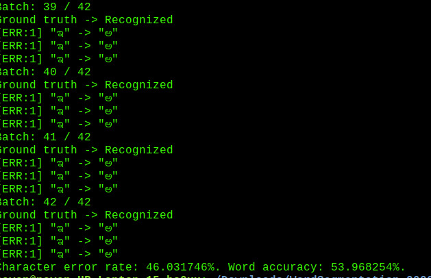
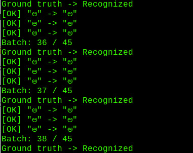

# Padaayi_proj
# Handwritten_text_recognition

Handwritten Text Recognition (HTR) system implemented with TensorFlow (TF) and trained on the IAM off-line HTR dataset.
This Neural Network (NN) model recognizes the text contained in the images of segmented words as shown in the illustration below.
As these word-images are smaller than images of complete text-lines, the NN can be kept small and training on the CPU is feasible.

<pre>Sentences in document are converted to words using word_segmentation</pre>

###accuracy

Custom dataset is prepared using the bounding box code and telugu dataset available using the https://drive.google.com/drive/folders/1upKAsWD4mmiX3Ow8ly2dggVvyYS3SYI3?usp=sharing

<h1>Steps</h1>

1)Go to the wordsegmentaion/src/ directory and main.py. Take care that the image files are placed directly into the wordsegmentaion/data/d2 and not some subdirectory. Afterwards, go to the src/ directory and run python main.py. The input image and the  output will be placed in the wordsegmentaion/out/.

2)Place the segmented images into the test/ folder and open src/ateva_main1.py and run with python. This analyses the images placed in the test folder and processed with neural network ,output written into Ateva.txt file.

<pre>py main.py
 to validate against a set of te3st files placed in the data folder
</pre>
3) In order to train the model use src/main.py and run with python main.py --train, these trained weights will be stored to the model/
<b>TRAINING:</b>
<pre>
 python main.py --train
Init with new values
Epoch: 1
Train NN
Batch: 1 / 400 Loss: 130.354
Batch: 2 / 400 Loss: 66.6619
Batch: 3 / 400 Loss: 36.0154
Batch: 4 / 400 Loss: 24.5898
Batch: 5 / 400 Loss: 20.1845
Batch: 6 / 400 Loss: 19.2857
Batch: 7 / 400 Loss: 18.3493
...

Validate NN

Character error rate: 13.956289%. Word accuracy: 67.721739%.
</pre>
<b>OUTPUT:</b>

<b> 

